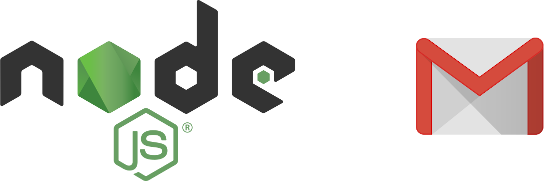

# API para envio de e-mail usando NodeJs e Gmail

Código usado pelo formulário de contato do meu site [www.douglascarlos.dev](https://www.douglascarlos.dev)

## Recursos usados no desenvolvimento:

- NodeJs;
- Express.js;
- Nodemailer;
- Postman (Para testar a API);

## Testando a API no Postman:

Caso queira testar a API no Postman, basta realizar os passos a seguir.

  Request URL             |  Tipo de requisição   |   Parâmetros do Body   | 
------------------------- | --------------------- | ---------------------- | 
http://localhost:3000     |       POST            | raw/JSON                    | 

```json
{
   "user":{
      "name":"SEU NOME",
      "email":"SEU@EMAIL.COM",
      "message":"SUA MENSAGEM"
   }
}
```

## Instalação:

Para começar, você deve simplesmente clonar o repositório do projeto na sua máquina e instalar as dependências.

### Pre-requisitos:

Antes de instalar as dependências no projeto, você precisa já ter instalado na sua máquina:

Node.Js: Caso não tenha, basta realizar o download [Aqui](https://nodejs.org/en/)

### Obtendo uma cópia:

```shell
# Antes de tudo, clone o projeto
$ git clone https://github.com/douglascsoliveira/api-node-gmail
```

### Configuração:

```shell
# Entre na pasta do projeto
$ cd api-node-gmail

# Instale as dependencias
$ npm install
```

### Execução:

```shell
# Execute o projeto
$ node app.js
```

### Usando o Gmail

Embora o Gmail seja a maneira mais rápida de começar a enviar e-mails, não é uma solução preferível, a menos que você esteja usando a autenticação OAuth2. O Gmail espera que o usuário seja um usuário real e não um robô, portanto, ele executa muitas heurísticas a cada tentativa de login e bloqueia qualquer coisa que pareça suspeita para defender o usuário de tentativas de invasão de conta. Por exemplo, você pode ter problemas se o servidor estiver em outro local geográfico - tudo funciona em sua máquina de desenvolvimento, mas as mensagens são bloqueadas na produção.

Além disso, o Gmail criou o conceito de aplicativos ["Menos seguros"](https://support.google.com/accounts/answer/6010255?hl=pt-br), basicamente qualquer pessoa que usa uma senha simples para fazer login no Gmail; portanto, você pode acabar em uma situação em que um nome de usuário pode enviar e-mails (o suporte para aplicativos "menos seguros" é ativado), mas outro está bloqueado (o suporte para aplicativos "menos seguros" está desativado). Você pode configurar sua conta do Gmail para permitir aplicativos menos seguros [aqui](https://www.google.com/settings/security/lesssecureapps) . Ao usar esse método, certifique-se de ativar também a funcionalidade necessária, concluindo o desafio [“Captcha Enable”](https://accounts.google.com/b/0/displayunlockcaptcha) . Sem isso, conexões menos seguras provavelmente não funcionariam.

Se você estiver usando o 2FA, terá que criar uma senha ["Específica do Aplicativo"](https://security.google.com/settings/security/apppasswords) para que o Nodemailer funcione.

O Gmail tem um limite de 500 destinatários por dia.